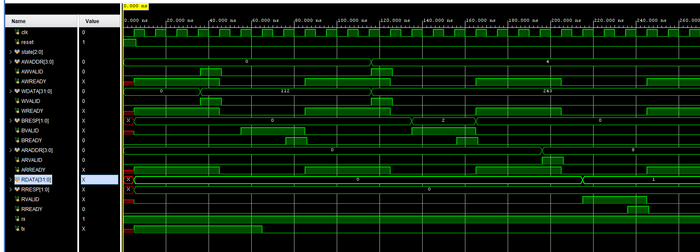
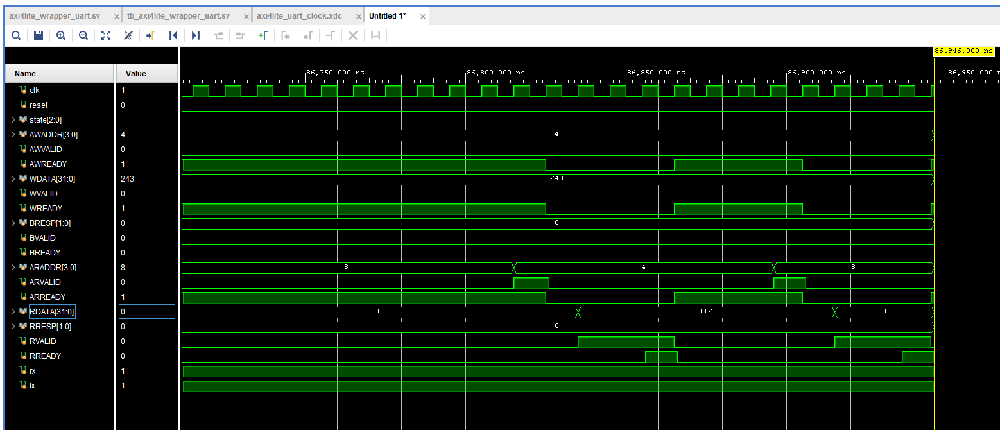

# AXI4Lite UART Wrapper — RV32I SoC

4-state slave FSM · 32-bit AXI4Lite bus · Synthesized for Basys 3 (Artix-7) · Simulation-verified

**Role in the system:**

This wrapper is the second piece I built for my RV32I SoC project, right after the UART. It sits between the CPU and the UART and lets the CPU talk to the UART through a standard bus (AXI4Lite), so the processor can send and receive bytes just by reading and writing a few memory addresses, without knowing anything about how the serial line actually works.

It exposes the UART as three registers the CPU can access: one to send a byte, one to read a received byte, and one to check the UART's status. Internally, the wrapper drives the `uart_tx` and `uart_rx` modules I built earlier. This is the step that connects the UART to the rest of the SoC, turning it from a standalone module into something the processor can actually use.

---

## System Architecture

The CPU acts as the AXI4Lite master and the wrapper is the slave. The wrapper exposes three memory-mapped registers and internally drives the `uart_tx` / `uart_rx` modules that handle the serial line. The physical path to the PC (pins, USB-UART bridge, PuTTY) is shown for context — verification was done in simulation using an internal loopback, wiring the wrapper's `tx` output back to its own `rx` input.

---

## Register Map

| Address | Name     | Access | Description                                        |
|---------|----------|--------|----------------------------------------------------|
| `0x00`  | TX_DATA  | Write  | Write a byte here to transmit it over the UART. Only bits [7:0] are used. |
| `0x04`  | RX_DATA  | Read   | Reads the last received byte (bits [7:0]). Reading clears the "byte ready" flag. |
| `0x08`  | STATUS   | Read   | Bit 0 = `tx_busy` (UART transmitting), Bit 1 = `done` (a received byte is waiting). |

Writing to any address other than TX_DATA, or reading any address other than RX_DATA / STATUS, returns a `SLVERR` (`2'b10`) response.

---

## The AXI4Lite Interface

AXI4Lite has five independent channels, each following the same VALID/READY handshake: the sender raises VALID when it has data, the receiver raises READY when it can accept, and the transfer happens on the clock edge where both are high.

- **Write:** AW (address), W (data), B (response)
- **Read:** AR (address), R (data + response)

The key rule the whole protocol depends on: once a sender raises VALID, it must hold VALID and keep its payload stable until the handshake completes — it can never lower VALID, and it can never wait for READY before raising VALID. Putting a value on the bus is *offering* it; the handshake is the *confirmation* the other side actually took it.

This wrapper is the slave: it drives the READY signals and the responses (B and R channels), and receives everything else from the master.

---

## The 4-State FSM

The wrapper runs on a 4-state FSM:

- **IDLE** — waiting for a transaction. All three READY signals (`AWREADY`, `WREADY`, `ARREADY`) are high here, so the wrapper is always ready to accept a request. On `AWVALID && WVALID` it goes to WRITE; on `ARVALID` it goes to READ_RESP.
- **WRITE** — a *pass-through* state that lasts exactly one cycle. It pulses `tx_start`, loads the captured byte into the UART, and decodes the response, then unconditionally moves to WRITE_RESP.
- **WRITE_RESP** — a *waiting* state. It holds `BVALID` and `BRESP` stable until the master raises `BREADY`, then returns to IDLE.
- **READ_RESP** — a *waiting* state for reads. It presents `RDATA` / `RRESP`, holds `RVALID` until the master raises `RREADY`, then returns to IDLE.

**Why WRITE and WRITE_RESP are separate:** a write has two jobs with incompatible durations. Pulsing `tx_start` must last exactly one cycle, but holding `BVALID` until `BREADY` can take any number of cycles. Combining both into one state would stretch the `tx_start` pulse across the entire wait, causing repeated transmissions. Splitting them keeps the one-cycle pulse in WRITE and the open-ended wait in WRITE_RESP.

**Why READ_RESP mirrors WRITE_RESP:** a read has the same open-ended wait as a write response — after presenting `RDATA` / `RRESP`, the wrapper can't know how many cycles the master will take to raise `RREADY`, so it needs a waiting state to hold `RVALID` stable until the handshake. Unlike the write side, reads don't need a separate one-cycle "action" state: there's no pulse to generate (no `tx_start` equivalent), just data to present and hold. So the read path is a single waiting state (READ_RESP), while the write path needs two (WRITE for the one-cycle `tx_start` pulse, WRITE_RESP for the wait). The difference comes from writes having a timed action and reads only having data to serve.

**Why the READY signals are just `state == IDLE`:** a READY signal reflects the wrapper's *capacity to accept a request*, not the content of any response. The wrapper is free to accept whenever it's idle, so all three READYs are simply high in IDLE and low otherwise. They come up high before the master even raises VALID (ready-before-valid), which is the simplest, deadlock-free handshake ordering.

---

## Design Notes

**Why the CAPTURED registers exist:**

The master only holds AWADDR, WDATA, and ARADDR stable *until the handshake completes*. After that edge, the spec lets the master change them to anything. But the FSM needs those values *after* the handshake — in WRITE / WRITE_RESP / READ_RESP — to decode the address, load the byte, and drive the response. So each is captured into a register on the handshake edge (`state == IDLE && AWVALID && WVALID` for writes, the AR handshake for reads), and the FSM works only with the frozen copies. This decouples the wrapper's internal timing from the master: WRITE can run any cycle later and still read stable values, no matter how fast the master moves on.

**`CAPTURED_RX_BYTE` and `CAPTURED_DONE` are captured by a different event:**

Unlike the address/data captures, which happen on an *AXI transaction* edge, these come from `uart_rx` on the PC's schedule — outside any transaction. `rx_byte` from the UART is only valid while the RX FSM is in its DONE state (one bit-period); it drops to 0 afterward. And the CPU may read RX_DATA long after the byte arrived. So `CAPTURED_RX_BYTE` latches the byte the moment it arrives and holds it, bridging the time gap between "a byte arrived" and "the CPU read it." `CAPTURED_DONE` is the "unread byte waiting" flag: it sets when a byte arrives and clears when the CPU reads RX_DATA (clear-on-read), so software can tell a fresh byte from one it already read.

**Detecting the rising edge of `done`:**

`done` from `uart_rx` is a *level* — it stays high for a full bit-period. Using it directly as the set condition for `CAPTURED_DONE` re-asserts the flag every cycle, which blocks the clear (see Bug 4). Instead, the wrapper detects `done`'s *rising edge*: `done_prev` is registered each cycle, and `done_rising = done & ~done_prev` is true for exactly one cycle when a byte completes. This sets the flag once per byte instead of continuously, so a read can clear it and it stays cleared. A data signal like `done` is never used as a clock — its edge is detected synchronously against the one system clock.

**Polled operation:**

The wrapper works in polled mode. Software should read STATUS before writing TX_DATA (to check `tx_busy`) and before reading RX_DATA (to check `done`). Writing while `tx_busy` is high drops the byte — standard polled-UART behavior. STATUS exists to give the data meaning: the data registers hold values, and STATUS tells software whether those values are worth acting on.

---

## Design Parameters

| Parameter        | Value              | Derivation                                  |
|------------------|--------------------|---------------------------------------------|
| Clock frequency  | 100 MHz            | Basys 3 onboard oscillator (pin W5)         |
| Bus width        | 32-bit             | AXI4Lite data bus (CPU word size); UART uses low 8 bits |
| Address width    | 4-bit              | Three word-aligned registers (0x00, 0x04, 0x08) |
| Error response   | SLVERR (`2'b10`)   | Returned for unmapped addresses             |
| Clock domain     | Single-clock (v1)  | UART and wrapper share one clock domain; async FIFO / CDC planned for a later version |
| Fmax (post-implementation) | ~266 MHz | WNS = +6.242ns @ 100MHz clock             |
| Critical path    | FSM state register → BRESP register | Write-response decode; total delay 3.174ns (logic 1.070ns, net 2.104ns) |

---

## Verification

All verification was done in simulation (behavioral) and synthesis (timing). The wrapper was not run on hardware — that comes when it's integrated with the CPU.

### Testbench — `tb/tb_axi4lite_wrapper_uart.sv`

The testbench uses a bus functional model (BFM): `axi_write` and `axi_read` tasks that drive full AXI transactions, plus a reusable `check` task for PASS/FAIL reporting.

| Test Case | Description                                              | Result |
|-----------|---------------------------------------------------------|--------|
| TC1       | Reset behavior — READY signals HIGH, VALIDs LOW after reset | PASS |
| TC2       | Normal TX_DATA write — byte 112, `tx_start` pulses, BRESP OKAY | PASS |
| TC3       | Bad-address write — SLVERR returned, `tx_start` stays LOW (expected fails) | PASS |
| TC4       | STATUS read — `tx_busy` HIGH (byte from TC2 still transmitting), `done` LOW → `01` | PASS |
| TC5       | Loopback round-trip — write byte 112, transmit → receive → read RX_DATA = 112 | PASS |
| TC6       | Read clears flag — after reading RX_DATA, `CAPTURED_DONE` LOW, STATUS confirms | PASS |

TC5 is the end-to-end proof: `tx` is wired to `rx`, so a byte written over AXI transmits serially, loops back, is received, and is read back over AXI — verifying the write path, both UART modules, the capture logic, and the read path in one transaction.

**SVA:**
- *(list the assertions you wrote here — e.g. "in IDLE, all READY signals HIGH and both VALIDs LOW")*

---

## Waveforms

**Write transactions — normal vs. bad address:**

The first write targets `AWADDR = 0x00` (TX_DATA) with `WDATA = 112` — `BRESP` returns `0` (OKAY). The second write targets `AWADDR = 0x04` (an unmapped write address) — `BRESP` returns `2` (SLVERR), and `tx_start` never pulses, confirming the wrapper rejects the bad address instead of transmitting. The `AWVALID`/`AWREADY` and `WVALID`/`WREADY` handshakes are visible, followed by `BVALID` held until `BREADY` completes each response.

**Loopback read — byte received back:**

This is the end of the loopback round-trip. The byte written earlier to TX_DATA (112) has transmitted serially, looped back through `rx`, been received, and is now read from RX_DATA — `RDATA` shows `112`. The `ARVALID`/`ARREADY` and `RVALID`/`RREADY` handshakes complete the read. This is the single clearest proof that the full path works: a byte written over AXI comes back over AXI with the correct value.

---

## Bugs Found and Fixed

### Bug 1: Multiple driver on `CAPTURED_DONE`
**Detected by:** Vivado synthesis / design review
**Root cause:** The flag was set in the capture block and cleared in the read block — two `always_ff` blocks driving the same signal, which Verilog does not allow.
**Fix:** Merged set and clear into a single block, with the set (`done_rising`) taking priority over the clear so a genuinely new byte is never lost.

### Bug 2: Clear too greedy — cleared on any read
**Detected by:** Simulation — a STATUS read was consuming the received byte
**Root cause:** The `CAPTURED_DONE` clear fired on any completed read, including STATUS reads, so reading STATUS destroyed an unread byte.
**Fix:** Gated the clear with `CAPTURED_ARADDR == RX_DATA`, so only an actual RX_DATA read consumes the byte.

### Bug 3: Uninitialized inputs poisoned `state`
**Detected by:** Waveform inspection — `state` showed X mid-simulation
**Root cause:** Testbench inputs (`ARVALID`, `BREADY`, `RREADY`, `rx`) were left uninitialized and floated at X. The IDLE next-state logic reads `ARVALID` in a ternary, so an X condition produced an X next-state.
**Fix:** Initialized every DUT input to a known value at the top of the `initial` block, before reset.

### Bug 4: `CAPTURED_DONE` wouldn't clear — level vs edge
**Detected by:** Tracing the failing clear cycle-by-cycle in the waveform
**Root cause:** `done` from `uart_rx` is a level, held HIGH for a full bit-period (868 cycles). Using it directly as the set condition re-asserted `CAPTURED_DONE` every cycle. Since the set has priority over the clear, a read during that 868-cycle window would clear the flag only for it to be re-set on the very next edge — the flag could never clear while `done` was still high.
**Fix:** Detected the *rising edge* of `done` instead of its level: `done_prev` registered each cycle, `done_rising = done & ~done_prev` true for one cycle only. The flag now sets once per byte, so a read clears it and it stays cleared.

---

## How to Simulate

### Requirements
- Xilinx Vivado

### Setting up the project
1. Create a new Vivado project (RTL Project). Use part `xc7a35tcpg236-1` if you plan to synthesize for Basys 3.
2. Add `src/axi4lite_wrapper_uart.sv` (and the `uart_tx.sv` / `uart_rx.sv` it instantiates) as design sources.
3. Add `tb/tb_axi4lite_wrapper_uart.sv` as a simulation source.
4. For timing analysis, add the `.xdc` constraint (defines the 100 MHz clock on `clk`) as a constraint source.

### Run the testbench
1. Right-click `tb/tb_axi4lite_wrapper_uart.sv` → **Set as Top**
2. Flow Navigator → **Run Simulation → Run Behavioral Simulation**
3. In the Tcl Console: `run -all`
4. Check the log for `PASS`/`FAIL` on each of the 6 test cases. TC3's fails are expected (bad-address error path).

### Timing (Fmax)
1. **Run Synthesis → Run Implementation**
2. Open the implemented design → **Report Timing Summary**
3. WNS should be positive (constraints met); Fmax = 1 / (clock period − WNS).
