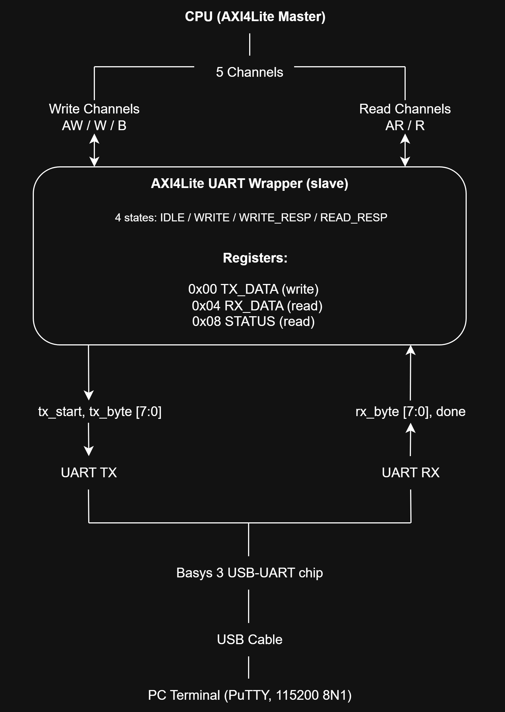
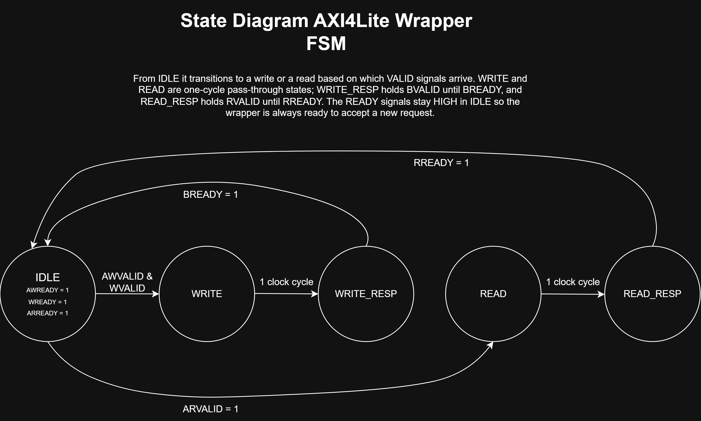
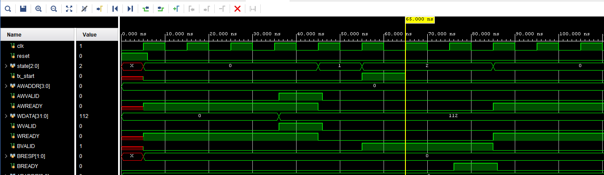
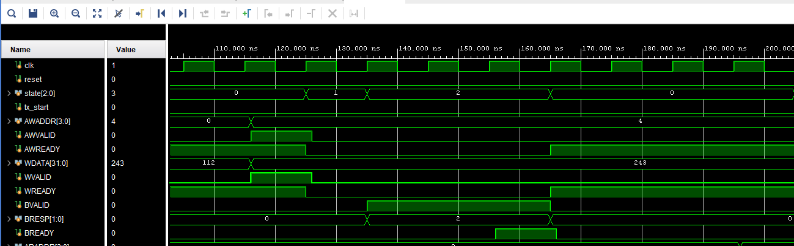
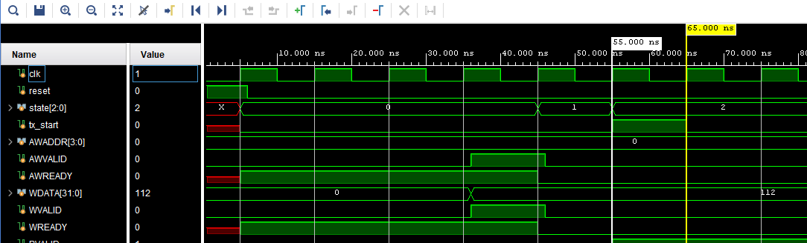
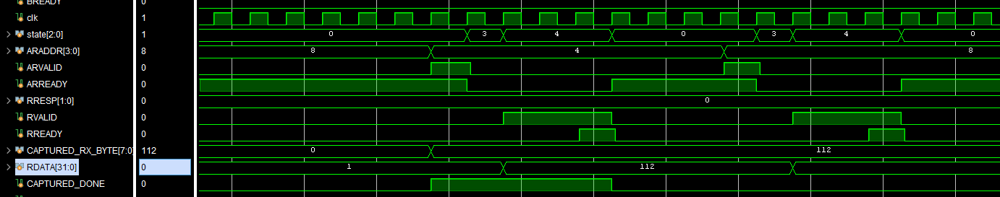
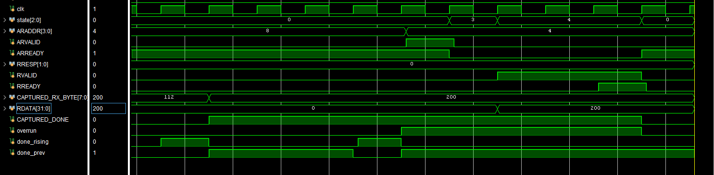

# AXI4Lite UART Wrapper — RV32I SoC

5-state slave FSM · 32-bit AXI4Lite bus · Synthesized for Basys 3 (Artix-7) · Simulation-verified

An AXI4Lite slave that exposes a UART as three memory-mapped registers, so a CPU
can send and receive bytes with ordinary loads and stores without knowing
anything about the serial line. It drives the `uart_tx` and `uart_rx` modules
built earlier, and is the piece that turns the UART from a standalone module into
something the processor can use.

---

## Register Map

| Address | Name | Access | Description |
|---|---|---|---|
| `0x00` | TX_DATA | Write | Write a byte to transmit. Only bits [7:0] are used. |
| `0x04` | RX_DATA | Read | Last received byte. Reading clears the `done` and `overrun` flags. |
| `0x08` | STATUS | Read | bit 0 `tx_busy`, bit 1 `done` (unread byte waiting), bit 2 `overrun` (a byte was dropped) |

Any other address returns `SLVERR` (`2'b10`).

Polled operation: software reads STATUS before writing TX_DATA (check `tx_busy`)
and before reading RX_DATA (check `done`). Writing while `tx_busy` is high drops
the byte — standard polled-UART behavior.

---

## System Architecture

The CPU is the AXI4Lite master, the wrapper is the slave. The physical path to the
PC is shown for context — verification used an internal loopback, wiring the
wrapper's `tx` output back to its own `rx` input.

AXI4Lite has five independent channels (AW, W, B for writes; AR, R for reads),
each using the same VALID/READY handshake. The rule the protocol depends on: once
a sender raises VALID it must hold VALID and keep its payload stable until the
handshake completes. Putting a value on the bus is *offering* it; the handshake is
the confirmation the other side took it.

---

## The 5-State FSM

| State | Role |
|---|---|
| IDLE | All three READYs high. `AWVALID && WVALID` → WRITE; `ARVALID` → READ. |
| WRITE | One-cycle action: pulse `tx_start`, load the byte, decode `BRESP`. |
| WRITE_RESP | Hold `BVALID` / `BRESP` until `BREADY`, then IDLE. |
| READ | One-cycle action: latch `RDATA` / `RRESP` from the captured address. |
| READ_RESP | Hold `RVALID` / `RDATA` / `RRESP` until `RREADY`, then IDLE. |

**Why each channel needs two states.** Both sides split "compute the response
once" from "hold it steady while waiting for the handshake."

On the write side the reason is timing: `tx_start` must pulse for exactly one
cycle, but holding `BVALID` until `BREADY` can take any number of cycles. Merging
them would stretch the pulse across the entire wait and retransmit repeatedly.

On the read side the reason is protocol correctness, and it is less obvious — I
initially thought READ was deletable, since reads have no one-cycle pulse to
guard. That was wrong. While `RVALID` is high, `RDATA` and `RRESP` must not
change. If the two states were merged and `RDATA` were recomputed every cycle, a
byte arriving mid-wait (`done_rising` firing while waiting for a slow `RREADY`)
would silently change `RDATA` under an asserted `RVALID` — a protocol violation,
and a real bug, since the master could sample a different value than it was
promised. Assigning `RDATA` only in READ makes this correct by construction.

**Why the READYs are just `state == IDLE`:** READY reflects capacity to accept a
request, not the content of a response. The wrapper can accept whenever it is
idle, so all three are high in IDLE and low otherwise — ready-before-valid, the
simplest deadlock-free ordering.

---

## Design Notes

**Captured address and data.** The master only holds AWADDR, WDATA and ARADDR
stable *until the handshake completes*; afterward the spec lets it change them
freely. But the FSM needs those values in the states that follow. Each is captured
on the handshake edge and the FSM works only from the frozen copies, which
decouples its internal timing from however fast the master moves on.

**`CAPTURED_RX_BYTE` and `CAPTURED_DONE` are captured by a different event.**
These come from `uart_rx` on the PC's schedule, outside any transaction.
`rx_byte` is valid only while the RX FSM is in DONE (one bit-period), and the CPU
may read RX_DATA long afterward — so the byte is latched on arrival and held.
`CAPTURED_DONE` is the "unread byte waiting" flag, set on arrival and cleared on
read, so software can distinguish a fresh byte from one it already consumed.

**Edge detection on `done`.** `done` is a *level*, high for a full bit-period.
Used directly it re-asserts the flag every cycle and blocks the clear (Bug 2).
`done_rising = done & ~done_prev` is true for exactly one cycle per byte. A data
signal is never used as a clock — its edge is detected synchronously.

**RX buffering — single-byte, oldest-held.** When a byte is already unread and a
new one arrives, the wrapper keeps the oldest and drops the new one, raising
`overrun`. The alternative (keep the newest) was rejected because it has a race: a
byte arriving during READ_RESP would overwrite `CAPTURED_RX_BYTE`, then the read
completion would clear `CAPTURED_DONE`, leaving a byte in the register while
STATUS reports nothing pending. Oldest-held has no such race, and it matches how a
classic single-byte UART data register behaves. A dropped byte is never silent.

---

## Design Parameters

| Parameter | Value | Derivation |
|---|---|---|
| Clock frequency | 100 MHz | Basys 3 onboard oscillator (pin W5) |
| Bus width | 32-bit | AXI4Lite data bus; UART uses low 8 bits |
| Address width | 4-bit | Three word-aligned registers |
| Error response | SLVERR (`2'b10`) | Unmapped addresses |
| Clock domain | Single-clock | UART and wrapper share one domain |
| Fmax (post-implementation) | ~257 MHz | WNS = +6.107 ns @ 100 MHz |
| Critical path | FSM state register → RRESP register | 3.404 ns total (logic 0.704, net 2.700) |

---

## Verification

Behavioral simulation and post-implementation timing. Not run on hardware — that
comes with CPU integration.

The testbench uses a bus functional model: `axi_write` and `axi_read` tasks
driving full transactions, plus a `check` task for PASS/FAIL. RX is fed by TX
loopback.

| TC | Description | Result |
|---|---|---|
| 1 | Reset — READYs high, VALIDs low | PASS |
| 2 | TX_DATA write — byte 112, one-cycle `tx_start`, BRESP OKAY | PASS |
| 3 | Bad-address write — SLVERR, `tx_start` stays low | PASS |
| 4 | STATUS read — `tx_busy` high, `done` low → `001` | PASS |
| 5 | Loopback round-trip — write 112, transmit → receive → read back 112 | PASS |
| 6 | Read clears flag — `CAPTURED_DONE` low, STATUS zero | PASS |
| 7 | Overrun — 200 unread, 55 forced in and dropped, `overrun` high, read returns 200 | PASS |

TC5 is the end-to-end proof: one transaction verifies the write path, both UART
modules, the capture logic and the read path. TC7 uses `force`/`release` on the RX
submodule to inject a second byte, since the loopback testbench has no directly
drivable `rx` line.

**SVA:** `p_idle_outputs`, `p_write_state`, `p_read_state`, `p_bvalid_low`,
`p_rvalid_low`, `p_captured_done_low`, `p_overrun_set`, `p_oldest_held` (the
formal statement of the oldest-held rule, using `$stable`).

---

## Waveforms

**1. Write — OKAY.** `state` steps 0→1→2. AW and W handshakes complete, `tx_start`
pulses once, `WDATA = 112` loads, `BRESP = 0`, `BVALID` held until `BREADY`.

**2. Write — SLVERR.** Same signals, `AWADDR = 0x04` (unmapped). `tx_start` never
pulses, `BRESP = 2`.

**3. `tx_start` is exactly one cycle.** Zoomed on WRITE→WRITE_RESP. Direct proof of
why WRITE is its own state: the pulse lasts one cycle even though the wait that
follows can take many.

**4. Two reads back-to-back.** STATUS returns `001` (`tx_busy` still high), then
RX_DATA returns 112. `CAPTURED_RX_BYTE` holds across both. Shows the full loopback
path and the latch-then-hold read FSM in one capture.

**5. Overrun — oldest held.** A second `done_rising` arrives while `CAPTURED_DONE`
is high; `overrun` rises and `CAPTURED_RX_BYTE` does **not** change to 55. The
following read returns 200 and clears both flags.

---

## Bugs Found and Fixed

**1 — Uninitialized inputs poisoned `state`.**
*Found by:* waveform inspection, `state` showed X mid-simulation.
*Cause:* testbench inputs (`ARVALID`, `BREADY`, `RREADY`, `rx`) floated at X; the
IDLE next-state ternary reads `ARVALID`, so an X condition produced an X state.
*Fix:* initialize every DUT input before reset.

**2 — `CAPTURED_DONE` wouldn't clear: level vs edge.**
*Found by:* tracing the failing clear cycle-by-cycle.
*Cause:* `done` is a level held high for 868 cycles. Used directly as the set
condition it re-asserted every cycle, and since set has priority over clear, a read
during that window cleared the flag only for it to be re-set on the next edge.
*Fix:* detect the rising edge instead — `done_rising = done & ~done_prev`.

**3 — A new RX byte could overwrite an unread one silently.**
*Found by:* design review of the capture logic.
*Cause:* the capture set `CAPTURED_RX_BYTE` and `CAPTURED_DONE` on every
`done_rising` with no guard, so a second byte overwrote the first with no
indication.
*Fix:* gate the capture on `!CAPTURED_DONE` and add the `overrun` flag.

---

## Known Limitations

- Single-byte RX buffer; faster arrivals are dropped and flagged via `overrun`.
- TC7 uses `force`/`release` to inject the second byte.
- Not run on hardware — behavioral simulation and timing only.

---

## How to Simulate

Requires Vivado. Part `xc7a35tcpg236-1` for Basys 3.

1. Add `src/axi4lite_wrapper_uart.sv` plus `uart_tx.sv` / `uart_rx.sv` as design
   sources, `tb/tb_axi4lite_wrapper_uart.sv` as a simulation source, and the
   `.xdc` (100 MHz on `clk`) as a constraint.
2. Set the testbench as top → **Run Behavioral Simulation** → `run -all`.
3. Check the log for PASS/FAIL on the 7 test cases. TC3's internal fails are the
   expected bad-address error path.

For timing: **Run Synthesis → Run Implementation → Report Timing Summary**.
Fmax = 1 / (clock period − WNS).
